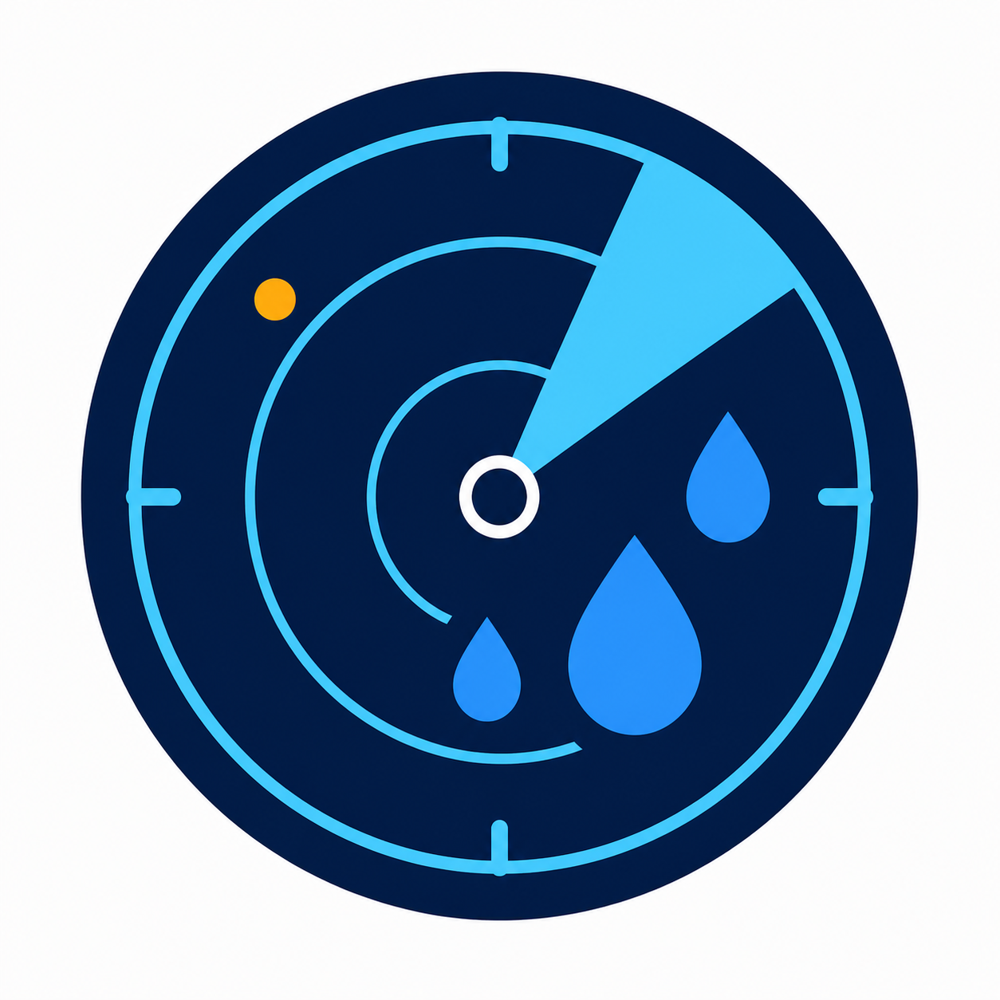

# Neerslag Radar for Home Assistant

<p align="center">
  
</p>

[](https://github.com/Timminater/neerslag-radar/actions/workflows/validate.yml)
[](https://github.com/Timminater/neerslag-radar/actions/workflows/tests.yml)

Neerslag Radar is a HACS custom integration for short-term precipitation
forecasts from Buienradar, Buienalarm, KNMI and Open-Meteo. Each configured location
can have one subentry per provider, so a failing provider does not replace or combine
data from another source.

> [!IMPORTANT]
> This is an initial `0.1.0` release. Buienalarm uses an undocumented endpoint and the
> KNMI seamless ensemble product is experimental. Either source can change or disappear
> without notice.

## Requirements

- Home Assistant 2026.6.0 or newer
- HACS for the recommended installation method
- A personal KNMI Open Data API key when using KNMI

## Installation

1. Open HACS in Home Assistant.
2. Add `https://github.com/Timminater/neerslag-radar` as a custom repository
   with category **Integration**.
3. Install **Neerslag Radar** and restart Home Assistant.
4. Go to **Settings → Devices & services → Add integration**.
5. Search for **Neerslag Radar**, create a location and add providers.

Manual installation is also possible by copying
`custom_components/neerslag_radar` to the `custom_components` directory in
your Home Assistant configuration directory, followed by a restart.

## Providers

| Provider | Resolution | Available horizon | Default poll | Notes |
|---|---:|---:|---:|---|
| Buienradar | 5 minutes | About 2 hours | 5 minutes | Public `raintext` feed |
| Buienalarm | Usually 5 minutes | About 2 hours | 5 minutes | Undocumented and experimental |
| KNMI | 5 minutes | First 3 hours exposed | 10 minutes | 20-member ensemble, personal key required |
| Open-Meteo | 15 minutes | 3 hours | 15 minutes | Free for non-commercial home automation |

Poll intervals can be changed through provider reconfiguration, but only within safe
limits: 5–15 minutes for Buienradar and Buienalarm, 5–30 for KNMI and 15–60 for
Open-Meteo.

Create a KNMI key in the [KNMI Data Platform API catalog](https://developer.dataplatform.knmi.nl/).
The integration uses the
[seamless ensemble precipitation forecast](https://dataplatform.knmi.nl/en/dataset/seamless-precipitation-ensemble-forecast-members-1-0),
downloads each new file once, samples only the configured 1×1-km cells and deletes the
temporary file when it is replaced or the integration unloads.

## Entities

Every provider creates one device containing:

- **Forecast total**: total expected precipitation over the provider's available
  horizon. Its `forecast` attribute contains every normalized point.
- **Forecast slot 1…N**: stable relative slots. The state is expected precipitation
  in millimetres for that interval.

Slot attributes include:

- `datetime`: exact UTC forecast timestamp
- `interval_minutes`: interval length
- `precipitation`: millimetres in the interval
- `precipitation_intensity`: equivalent `mm/h`
- `probability` and `uncertainty`: available for KNMI ensemble points
- `provider` and `slot`

Providers are never blended and missing horizons are never extrapolated. A provider
update failure marks only that provider's entities unavailable; the coordinator keeps
the last valid response internally and publishes new data after recovery.

## Example automation

Use a native numeric-state trigger on an upcoming slot:

```yaml
triggers:
  - trigger: numeric_state
    entity_id: sensor.home_buienradar_forecast_slot_1
    above: 0.2
actions:
  - action: notify.notify
    data:
      message: "Rain is expected in the next interval."
```

Entity IDs depend on the location and provider names generated by Home Assistant.

## Data use and attribution

- Buienradar data: [buienradar.nl](https://www.buienradar.nl/)
- Buienalarm data: [buienalarm.nl](https://www.buienalarm.nl/)
- KNMI data: [KNMI Data Platform](https://dataplatform.knmi.nl/), CC BY 4.0
- Open-Meteo data: [Open-Meteo](https://open-meteo.com/), CC BY 4.0. The free API is
  limited to non-commercial use under its [terms](https://open-meteo.com/en/terms).

## Troubleshooting

- Download diagnostics from the integration entry. API keys and coordinates are
  redacted.
- A KNMI `invalid_auth` error means the personal key was rejected. Reconfigure the
  provider after replacing it.
- Buienalarm may return HTML, 5xx responses or a changed schema. The integration fails
  closed instead of reporting false dry weather.
- Enable debug logging for `custom_components.neerslag_radar` when reporting an
  issue, but never publish an unredacted API key.

Please report bugs through the [issue tracker](https://github.com/Timminater/neerslag-radar/issues).
